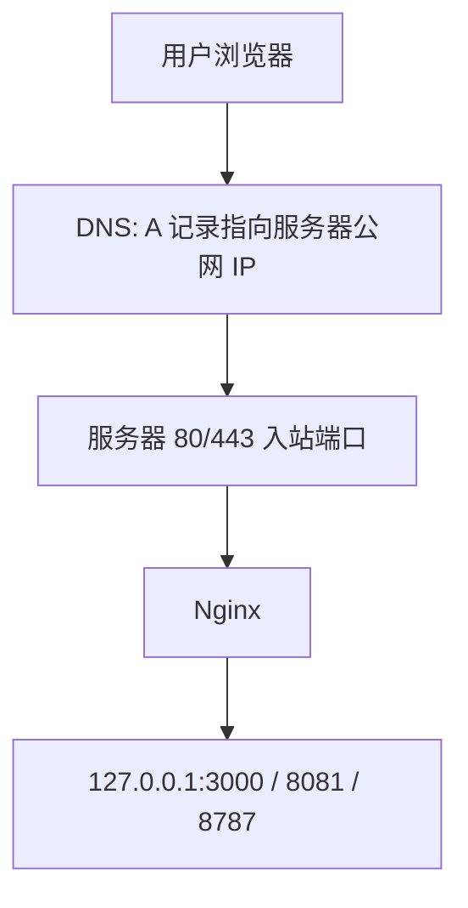
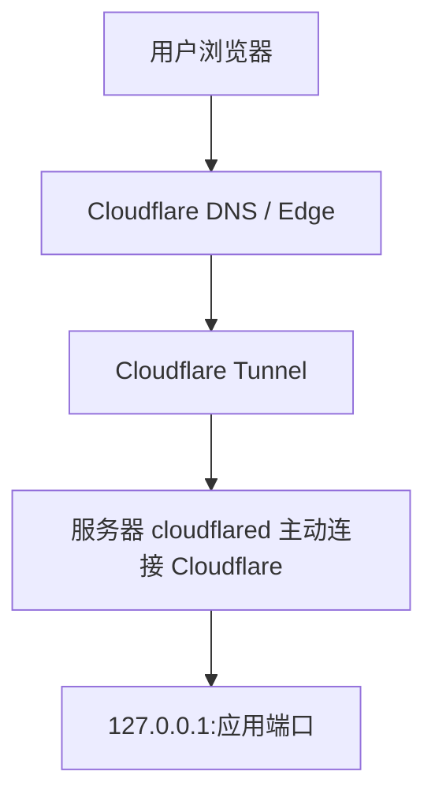
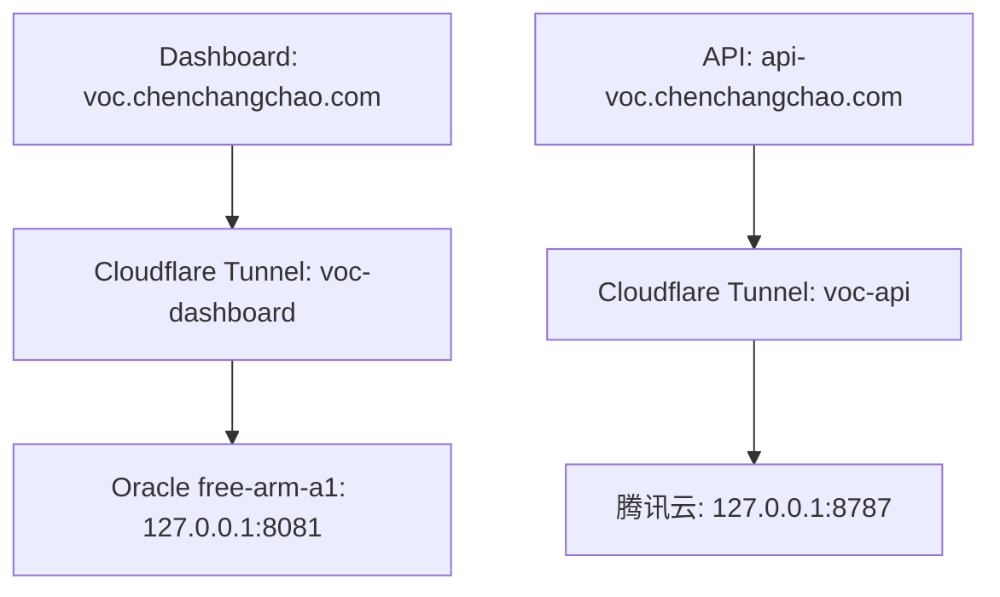

# Cloudflare Tunnel 技术记录：原理、应用场景与部署注意事项

本文整理 Cloudflare Tunnel（也常叫 CF Tunnel / cloudflared / Argo Tunnel）的技术原理、典型应用场景、部署模式、常见踩坑和排查方法。格式参考个人 DevOpsLog 的记录方式，目标不是只写概念，而是沉淀以后能直接复用的运维经验。

## 1. Cloudflare Tunnel 是什么

Cloudflare Tunnel 是 Cloudflare Zero Trust 提供的一种反向连接能力。传统 Web 部署通常需要服务器暴露公网 IP，并开放 80/443 端口；而 Tunnel 的模式是：服务器本地运行 `cloudflared`，由它主动向 Cloudflare 建立一条出站加密连接，Cloudflare 再把外部用户请求通过这条连接转发到服务器本地服务。

简单理解：

```txt
用户浏览器
  ↓
Cloudflare 边缘节点
  ↓
Cloudflare Tunnel
  ↓
服务器上的 cloudflared
  ↓
127.0.0.1:应用端口
```

核心变化是：

- 源站不需要直接暴露 80/443。
- 源站服务可以只监听 `127.0.0.1`。
- Cloudflare 负责公网入口、TLS 证书、边缘代理和安全策略。
- 服务器只需要能主动访问 Cloudflare 网络。

## 2. 传统反向代理 vs Cloudflare Tunnel

传统 Nginx 部署：



Cloudflare Tunnel 部署：



两者主要差异：

| 对比项 | 传统 Nginx | Cloudflare Tunnel |
|---|---|---|
| 公网 IP | 通常需要 | 不强依赖 |
| 入站端口 | 需要开放 80/443 | 可以不开放 80/443 |
| TLS 证书 | 自己配置 Certbot/Nginx | Cloudflare 自动处理 |
| 源站暴露面 | 较大 | 较小 |
| 内网服务发布 | 麻烦 | 很适合 |
| 适合国内备案场景 | 国内云 80/443 可能受备案影响 | 服务器主动出站，通常绕开直接入站暴露 |
| 复杂度 | Nginx/证书/防火墙 | Tunnel/Route/DNS/Connector |

注意：Tunnel 不是“免备案神器”的正式合规结论，它只是技术上不要求源站直接开放 80/443 入站。是否需要备案，仍取决于域名、服务面向地区、云厂商和当地监管要求。

## 3. 核心组件

### 3.1 Cloudflare DNS

域名仍由 Cloudflare DNS 托管。Tunnel route 保存后，Cloudflare 会自动生成类似下面的 DNS 记录：

```txt
api-voc.chenchangchao.com
CNAME
< tunnel-id >.cfargotunnel.com
Proxied
```

如果开启橙云代理，外部查询时可能只看到 Cloudflare 的 A 记录：

```txt
104.21.x.x
172.67.x.x
```

这并不代表 CNAME 没生效，只是 Cloudflare 对外隐藏了真实 Tunnel CNAME。

### 3.2 cloudflared

`cloudflared` 是运行在源站服务器上的客户端程序。它负责：

- 使用 token 连接指定 Tunnel。
- 和 Cloudflare 建立 QUIC / HTTP2 出站连接。
- 接收 Cloudflare 转发来的请求。
- 转发到本机服务，例如 `http://127.0.0.1:8787`。

常见服务状态检查：

```bash
sudo systemctl status cloudflared
journalctl -u cloudflared -n 100 --no-pager
journalctl -u cloudflared -f
```

正常日志中应出现：

```txt
Starting tunnel tunnelID=...
Registered tunnel connection
Environment is healthy
Updated to new configuration
```

### 3.3 Tunnel

Tunnel 是 Cloudflare 侧的逻辑通道。一个 Tunnel 可以有一个或多个 connector，也就是多个运行中的 `cloudflared` 实例。

需要特别注意：

- 如果同一个 Tunnel 在多台服务器上作为 replica 运行，而这些服务器没有部署完全相同的服务，请求可能被随机转发到错误机器。
- 如果两台机器分别跑 API 和 Dashboard，最好拆成两个 Tunnel。

推荐模式：

```txt
voc-api tunnel       -> 腾讯云 API 机器       -> 127.0.0.1:8787
voc-dashboard tunnel -> Oracle Dashboard 机器 -> 127.0.0.1:8081
```

不推荐模式：

```txt
同一个 tunnel 同时在腾讯云和 Oracle 运行
api-voc 和 voc 两个 hostname 都挂在同一个 tunnel
但两台机器只分别运行部分服务
```

这种模式容易导致偶发 502、1033、404 或随机转发失败。

### 3.4 Hostname Route / Published Application Route

Route 决定哪个域名转发到哪个本地服务。例如：

```txt
api-voc.chenchangchao.com -> http://127.0.0.1:8787
voc.chenchangchao.com     -> http://127.0.0.1:8081
```

在 Cloudflare 新版 UI 中，相关入口可能叫：

```txt
Zero Trust
→ Networks
→ Tunnels / Connectors
→ 选择 Tunnel
→ Published application routes
```

不要把 HTTP 服务误配置到 `CIDR routes`。CIDR routes 更多是私有网络路由场景，不是普通网站域名发布入口。

## 4. 典型应用场景

### 4.1 私有云主机发布 Web 应用

适合个人项目、小型后台、Next.js、Node.js、Fastify、Hono、Python API 等。

例如：

```txt
https://voc.chenchangchao.com
→ Cloudflare Tunnel
→ Oracle free-arm-a1
→ 127.0.0.1:8081
→ Next.js Dashboard
```

### 4.2 API 服务跨云部署

例如 API 在腾讯云，Dashboard 在 Oracle：



这种模式可以避免：

- 腾讯云备案/入站端口问题。
- 直接暴露 API 源站 IP。
- 跨云安全组、防火墙、Nginx 证书配置过多。

### 4.3 本地开发临时暴露

本地开发时可以把 `localhost:3000` 临时暴露给外部访问，类似 ngrok：

```bash
cloudflared tunnel --url http://127.0.0.1:3000
```

适合：

- Webhook 调试。
- 飞书/Slack/Stripe/GitHub 回调测试。
- 临时给别人看本地页面。

生产环境建议使用命名 Tunnel + systemd service，而不是临时 quick tunnel。

### 4.4 内网服务安全访问

Cloudflare Tunnel 可以结合 Zero Trust Access 做鉴权：

```txt
用户访问 admin.example.com
→ Cloudflare Access 登录校验
→ 通过后才进入 Tunnel
→ 内网服务
```

适合：

- 内部管理后台。
- 数据看板。
- Grafana、Prometheus、pgAdmin 等运维工具。
- 不希望裸奔在公网的服务。

## 5. 标准部署流程

### 5.1 在 Cloudflare 创建 Tunnel

在 Cloudflare Zero Trust 中创建 Tunnel，例如：

```txt
Tunnel name: voc-api
```

选择服务器系统，例如：

```txt
Debian / Ubuntu
amd64 或 arm64
```

Cloudflare 会生成安装命令：

```bash
sudo cloudflared service install <tunnel-token>
```

Token 是敏感信息，不要提交到 Git，不要贴到公开文档。

### 5.2 安装 cloudflared

Ubuntu/Debian 可用 apt 源安装：

```bash
sudo mkdir -p --mode=0755 /usr/share/keyrings

curl -fsSL https://pkg.cloudflare.com/cloudflare-main.gpg \
  | sudo tee /usr/share/keyrings/cloudflare-main.gpg >/dev/null

echo "deb [signed-by=/usr/share/keyrings/cloudflare-main.gpg] https://pkg.cloudflare.com/cloudflared any main" \
  | sudo tee /etc/apt/sources.list.d/cloudflared.list

sudo apt update
sudo apt install -y cloudflared
cloudflared --version
```

如果 apt 找不到包，也可以下载 `.deb`：

```bash
# x86_64
wget https://github.com/cloudflare/cloudflared/releases/latest/download/cloudflared-linux-amd64.deb
sudo dpkg -i cloudflared-linux-amd64.deb

# ARM64
wget https://github.com/cloudflare/cloudflared/releases/latest/download/cloudflared-linux-arm64.deb
sudo dpkg -i cloudflared-linux-arm64.deb
```

### 5.3 安装为 systemd 服务

```bash
sudo cloudflared service install <tunnel-token>
sudo systemctl daemon-reload
sudo systemctl enable cloudflared
sudo systemctl restart cloudflared
sudo systemctl status cloudflared
```

查看日志：

```bash
journalctl -u cloudflared -n 100 --no-pager
```

### 5.4 添加 Published Application Route

例如 API：

```txt
Hostname: api-voc.chenchangchao.com
Service Type: HTTP
Service URL: 127.0.0.1:8787
```

例如 Dashboard：

```txt
Hostname: voc.chenchangchao.com
Service Type: HTTP
Service URL: 127.0.0.1:8081
```

保存后，Cloudflare DNS 页面应该能看到对应 Tunnel 记录。

### 5.5 本机服务监听

应用本身建议监听本地地址或本机端口：

```bash
curl -I http://127.0.0.1:8787/health
curl -I http://127.0.0.1:8081
```

只有本机通了，Tunnel 才可能通。

## 6. DNS 生效与验证

### 6.1 查询 DNS

```bash
dig api-voc.chenchangchao.com
dig @1.1.1.1 api-voc.chenchangchao.com
```

如果默认 DNS 返回 NXDOMAIN，但 `@1.1.1.1` 能解析，说明本机 DNS 缓存或上游 DNS 还没刷新。

### 6.2 橙云代理下 CNAME 不一定可见

如果执行：

```bash
dig @1.1.1.1 api-voc.chenchangchao.com CNAME
```

结果没有 CNAME，但 A 记录返回 Cloudflare IP，例如：

```txt
104.21.x.x
172.67.x.x
```

通常也是正常的。Cloudflare 代理会隐藏真实 CNAME。

### 6.3 绕过 DNS 缓存验证

如果已经知道 Cloudflare A 记录，可以用 `--resolve` 临时验证链路：

```bash
curl -i --resolve api-voc.chenchangchao.com:443:104.21.44.224 \
  https://api-voc.chenchangchao.com/health
```

如果返回 200，说明公网链路、Tunnel 和 API 都是好的，问题只在本机 DNS。

## 7. 常见错误与排查

### 7.1 Error 1033

现象：

```txt
Cloudflare Error 1033
Argo Tunnel error
```

常见原因：

- DNS 没有指向正确的 Tunnel。
- Route 没保存成功。
- Tunnel 没有 active connector。
- DNS 还指向旧 tunnel id。
- 删除过旧 DNS 记录后，新记录还没生成。

排查：

```bash
# Cloudflare Dashboard 确认 Tunnel Healthy
sudo systemctl status cloudflared
journalctl -u cloudflared -n 100 --no-pager

# DNS 查询
dig @1.1.1.1 api-voc.chenchangchao.com

# 本地服务确认
curl http://127.0.0.1:8787/health
```

处理：

- 重新保存 Published application route。
- 删除旧 DNS 记录后让 Tunnel 自动创建新记录。
- 必要时手动添加 CNAME：

```txt
api-voc -> <tunnel-id>.cfargotunnel.com
Proxied
```

### 7.2 Could not resolve host / NXDOMAIN

现象：

```bash
curl: (6) Could not resolve host: api-voc.chenchangchao.com
```

先对比：

```bash
dig api-voc.chenchangchao.com
dig @1.1.1.1 api-voc.chenchangchao.com
```

如果 `@1.1.1.1` 正常，默认 DNS 不正常，说明本机 DNS 问题。

Oracle Ubuntu 中常见默认 DNS：

```txt
169.254.169.254
```

可以临时指定网卡 DNS：

```bash
resolvectl status
sudo resolvectl dns enp0s6 1.1.1.1 1.0.0.1
sudo resolvectl domain enp0s6 "~."
sudo resolvectl flush-caches
```

再测试：

```bash
dig api-voc.chenchangchao.com
curl -i https://api-voc.chenchangchao.com/health
```

### 7.3 502 / 500

502 通常更偏向 Tunnel 到源站服务失败；500 通常说明请求已经进入应用，但应用内部报错。

排查顺序：

```bash
# 1. 本机服务是否存在
ss -lntp | grep -E '8787|8081|3000'

# 2. 本机接口是否通
curl -I http://127.0.0.1:8081
curl http://127.0.0.1:8787/health

# 3. PM2 状态
pm2 status
pm2 logs <app-name> --lines 100

# 4. cloudflared 日志
journalctl -u cloudflared -n 100 --no-pager
```

如果应用日志出现：

```txt
connect ECONNREFUSED 127.0.0.1:8088
```

说明不是 Tunnel 问题，而是应用还在请求旧 API 地址。

### 7.4 同一个 Tunnel 多机器 replica 导致随机失败

如果一个 Tunnel 同时在 A、B 两台机器运行，而 A 只有 Dashboard，B 只有 API，则 Cloudflare 可能把 API 请求转到 A，或者把 Dashboard 请求转到 B。

解决：

```txt
一个服务域名对应一个明确的 Tunnel
一个 Tunnel 的所有 connector 应部署相同服务能力
```

推荐：

```txt
api-voc tunnel       只装在 API 机器
voc-dashboard tunnel 只装在 Dashboard 机器
```

### 7.5 cloudflared service 已存在

现象：

```txt
cloudflared service is already installed
```

清理旧服务：

```bash
sudo systemctl stop cloudflared 2>/dev/null || true
sudo systemctl disable cloudflared 2>/dev/null || true
sudo cloudflared service uninstall 2>/dev/null || true
sudo rm -f /etc/systemd/system/cloudflared.service
sudo rm -f /etc/systemd/system/cloudflared-update.service
sudo rm -f /etc/systemd/system/cloudflared-update.timer
sudo systemctl daemon-reload
sudo systemctl reset-failed
```

再重新安装新 Tunnel token。

## 8. Cloudflare Tunnel 与 Nginx 的关系

Tunnel 不一定要替代 Nginx。两种模式都可以。

### 8.1 Tunnel 直接转发到应用

```txt
Cloudflare Tunnel -> 127.0.0.1:8081 -> Next.js
```

优点：简单，少一层。

适合：

- 单服务。
- 应用自己处理路由。
- 不需要本机多路径反代。

### 8.2 Tunnel 转发到 Nginx

```txt
Cloudflare Tunnel -> 127.0.0.1:80 -> Nginx -> 多个本地服务
```

优点：本机仍然可以做复杂反向代理：

- `/api` 转 API。
- `/` 转前端。
- 静态资源缓存。
- 多服务路径分发。

但复杂度更高。个人项目中，如果 Cloudflare Tunnel 已经按域名拆分，通常可以不加 Nginx。

## 9. 安全注意事项

### 9.1 Tunnel token 是敏感信息

`cloudflared service install <token>` 里的 token 可以让任何机器接入你的 Tunnel。不要：

- 提交到 Git。
- 贴到公开 issue。
- 写进 README。
- 在截图里完整暴露。

如果泄露，建议在 Cloudflare 中 rotate token，然后重新安装服务。

### 9.2 源站服务尽量只监听本地

推荐：

```txt
127.0.0.1:8787
127.0.0.1:8081
```

不推荐无必要地暴露：

```txt
0.0.0.0:8787
0.0.0.0:8081
```

这样即使服务器安全组误开放端口，外部也不容易直接绕过 Cloudflare 访问源站。

### 9.3 管理后台建议加 Access

对于后台、Grafana、数据库面板等，不要只靠隐藏路径。可以使用 Cloudflare Access：

```txt
admin.example.com
→ 只允许指定邮箱登录
→ 再进入 Tunnel
```

### 9.4 不要把公网 API 当私网 API

Tunnel 只是隐藏源站，不代表 API 自动安全。公开 API 仍然需要：

- 鉴权。
- CORS 控制。
- Rate Limit。
- 输入校验。
- 日志与错误处理。

## 10. 部署检查清单

### 10.1 Cloudflare 侧

- Tunnel 是否 Healthy。
- Connector 是否在正确机器上。
- Hostname route 是否保存成功。
- DNS 是否自动生成。
- 是否误用了旧 Tunnel ID。
- 是否把 HTTP 服务配置到了 CIDR route。

### 10.2 服务器侧

```bash
sudo systemctl status cloudflared
journalctl -u cloudflared -n 100 --no-pager
pm2 status
ss -lntp
curl http://127.0.0.1:<port>
```

### 10.3 DNS 侧

```bash
dig <domain>
dig @1.1.1.1 <domain>
resolvectl query <domain>
```

如果默认 DNS 异常，但 `@1.1.1.1` 正常，优先修本机 DNS。

### 10.4 应用侧

- 环境变量是否仍指向 localhost 旧端口。
- `.env.production`、`.env.local`、`.env.production.local` 是否互相覆盖。
- 构建产物里是否残留旧地址：

```bash
grep -R "8088" -n . --exclude-dir=node_modules --exclude-dir=.git
grep -R "8088" -n .next 2>/dev/null
```

- PM2 是否重启到了新配置。

```bash
pm2 delete <app> 2>/dev/null || true
pm2 start ecosystem.config.cjs
pm2 save
```

## 11. 结合本次 VOC 部署的经验

本次实际部署中，最终架构为：

```txt
voc.chenchangchao.com
→ Tunnel: voc-dashboard
→ Oracle free-arm-a1
→ 127.0.0.1:8081
→ Next.js Dashboard

api-voc.chenchangchao.com
→ Tunnel: voc-api
→ 腾讯云
→ 127.0.0.1:8787
→ VOC API
```

关键踩坑点：

1. 一开始容易把 Cloudflare 1033 误认为备案问题。实际不是备案，而是 DNS/Tunnel route 没正确绑定。
2. API tunnel 一度装错机器。API 实际在腾讯云，所以 `voc-api` connector 必须运行在腾讯云。
3. 删除旧 DNS 后，必须从新 Tunnel 的 Published application routes 重新添加 hostname route。
4. Cloudflare DNS 页面显示 Tunnel 后，外部 `dig CNAME` 不一定能看到 CNAME；橙云代理会返回 Cloudflare A 记录。
5. Oracle 默认 DNS `169.254.169.254` 缓存了 NXDOMAIN，导致本机 `curl` 解析失败；用 `dig @1.1.1.1` 能确认 Cloudflare 侧已经生效。
6. `curl --resolve` 是验证“DNS 之外链路是否正常”的好办法。
7. Dashboard 500 不是 Tunnel 问题，而是 `.env.production` 里仍残留 `NEXT_PUBLIC_API_BASE_URL=http://localhost:8088/`。
8. 修改 `.env.production` 后必须重新 build，并重启 PM2。
9. `grep -R "8088"` 和 `grep -R "8088" .next` 是确认旧地址是否清理干净的关键命令。
10. `curl -I http://127.0.0.1:8081` 返回 200 后，说明 Dashboard 本机服务恢复，再看公网域名才有意义。

## 12. 常用命令

安装 cloudflared：

```bash
sudo apt update
sudo apt install -y cloudflared
cloudflared --version
```

安装 Tunnel 服务：

```bash
sudo cloudflared service install <tunnel-token>
sudo systemctl enable cloudflared
sudo systemctl restart cloudflared
```

查看 Tunnel 日志：

```bash
sudo systemctl status cloudflared
journalctl -u cloudflared -n 100 --no-pager
journalctl -u cloudflared -f
```

检查本机端口：

```bash
ss -lntp | grep -E '3000|8081|8787'
```

检查 DNS：

```bash
dig example.com
dig @1.1.1.1 example.com
resolvectl query example.com
```

临时指定 DNS：

```bash
sudo resolvectl dns enp0s6 1.1.1.1 1.0.0.1
sudo resolvectl domain enp0s6 "~."
sudo resolvectl flush-caches
```

绕过 DNS 测试 HTTPS：

```bash
curl -i --resolve api.example.com:443:104.21.x.x https://api.example.com/health
```

检查旧环境变量残留：

```bash
grep -R "localhost:8088" -n . --exclude-dir=node_modules --exclude-dir=.git
grep -R "8088" -n .next 2>/dev/null
```

PM2 重启应用：

```bash
pm2 delete voc-dashboard 2>/dev/null || true
pm2 start voc-dashboard.ecosystem.config.cjs
pm2 save
```

## 13. 经验总结

- Cloudflare Tunnel 的本质是“源站主动出站连接 Cloudflare”，不是传统入站暴露端口。
- 1033 多数是 Tunnel/DNS/Route 绑定问题，不要第一时间怀疑应用代码。
- 500 多数说明请求已经进入应用，要看应用日志，不要继续盲目改 DNS。
- 一个 Tunnel 可以多个 connector，但只有在多台机器服务完全一致时才适合做 replica。
- 跨云部署时，API 和 Dashboard 最好拆成不同 Tunnel，避免路由随机落错机器。
- Cloudflare 橙云代理后，外部 `dig CNAME` 不一定能看到真实 CNAME，看到 Cloudflare A 记录通常也是正常的。
- `dig @1.1.1.1` 可以绕过本机 DNS 上游，判断 Cloudflare 侧是否已经生效。
- `curl --resolve` 是定位 DNS 问题和链路问题的利器。
- Oracle 默认 DNS 可能缓存 NXDOMAIN，必要时给网卡指定 `1.1.1.1`。
- Tunnel 通了不代表应用通了，应用仍然可能因为 `.env.production`、PM2 未重启、旧 build 产物而报错。
- 生产部署要分层排查：DNS → Tunnel → 本机端口 → 应用日志 → 环境变量 → 构建产物。
- Token、Secret、Tunnel install command 不要写进公开仓库；如果泄露，及时 rotate。
