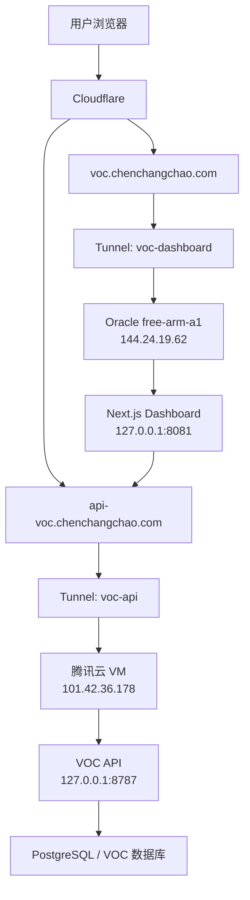
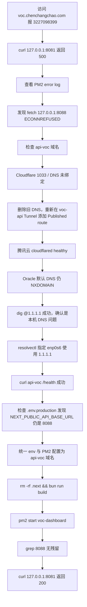

# VOC Dashboard DevOps 记录：Cloudflare Tunnel 跨云部署与 500/1033/NXDOMAIN 排障

本文记录 `voc-review-insight-agent` 的 dashboard 与 API 跨云部署过程。目标是把 **Next.js Dashboard** 部署在甲骨文云 `free-arm-a1`，把 **VOC API** 部署在腾讯云，并通过 **Cloudflare Tunnel** 暴露两个 HTTPS 域名。

这次排障的重点不是单个命令，而是完整沉淀：多云主机职责划分、Cloudflare Tunnel 路由绑定、DNS 解析缓存、Next.js 构建期环境变量、PM2 进程管理，以及 `ERROR 3227098399` 的定位过程。

## 1. 最终结果

最终两个域名均恢复正常：

```txt
voc.chenchangchao.com       -> Oracle free-arm-a1 -> 127.0.0.1:8081 -> Next.js Dashboard
api-voc.chenchangchao.com   -> 腾讯云 VM         -> 127.0.0.1:8787 -> VOC API
```

最终本机验证结果：

```bash
curl https://api-voc.chenchangchao.com/health
```

返回：

```json
{"status":"ok","db_time":"2026-07-05T09:21:31.127Z"}
```

Dashboard 本机验证：

```bash
curl -I http://127.0.0.1:8081
```

返回：

```txt
HTTP/1.1 200 OK
X-Powered-By: Next.js
Content-Type: text/html; charset=utf-8
```

PM2 状态：

```txt
voc-dashboard  online
zen-practice   online
```

## 2. 当前部署拓扑



关键原则：

- `voc-dashboard` Tunnel 只安装在 Oracle `free-arm-a1`。
- `voc-api` Tunnel 只安装在腾讯云 `101.42.36.178`。
- 不要把同一个 Tunnel 同时作为 replica 安装在多台职责不同的机器上。
- Cloudflare Tunnel 不依赖云厂商开放 80/443 入站端口。
- Dashboard 服务端渲染时会请求 API，所以 Dashboard 所在机器必须能解析并访问 `api-voc.chenchangchao.com`。

## 3. 主机职责划分

### 3.1 Oracle free-arm-a1

```txt
公网 IP: 144.24.19.62
用户: ubuntu
主要服务:
  - zen-practice: 3000
  - voc-dashboard: 8081
  - Cloudflare Tunnel: voc-dashboard
```

Dashboard 项目目录：

```bash
/home/ubuntu/apps/voc-review-insight-agent/apps/dashboard
```

### 3.2 腾讯云

```txt
公网 IP: 101.42.36.178
用户: root
主要服务:
  - voc-api: 8787
  - Cloudflare Tunnel: voc-api
```

API 本机健康检查：

```bash
curl http://127.0.0.1:8787/health
```

预期：

```json
{"status":"ok","db_time":"..."}
```

### 3.3 误判过的机器

曾经误把另一台 Oracle 低配机器当成腾讯云：

```txt
132.226.155.245
```

后来确认它不是 VOC API 的真实部署机器，不应该承载 `api-voc` Tunnel。

## 4. Cloudflare Tunnel 配置

### 4.1 voc-api Tunnel

Tunnel ID：

```txt
92bc24ff-21ea-493e-9001-e7014b34c5a9
```

安装位置：腾讯云 `101.42.36.178`

Hostname route：

```txt
api-voc.chenchangchao.com -> http://127.0.0.1:8787
```

腾讯云上的 `cloudflared` 日志显示：

```txt
Starting tunnel tunnelID=92bc24ff-21ea-493e-9001-e7014b34c5a9
Registered tunnel connection
Environment is healthy
Updated to new configuration:
api-voc.chenchangchao.com -> http://127.0.0.1:8787
```

这说明：

- Tunnel 进程已启动。
- Connector 已连接 Cloudflare。
- Cloudflare API 可达。
- 路由配置已经下发到本机 `cloudflared`。

### 4.2 voc-dashboard Tunnel

安装位置：Oracle `free-arm-a1`

Hostname route：

```txt
voc.chenchangchao.com -> http://127.0.0.1:8081
```

Dashboard 本机服务由 PM2 管理。

## 5. 第一类问题：Cloudflare 1033

### 5.1 现象

访问：

```bash
curl https://api-voc.chenchangchao.com/health
```

返回 Cloudflare 错误：

```txt
error code: 1033
```

### 5.2 错误含义

`1033` 通常表示 Cloudflare 没有找到可用的 Tunnel 路由，常见原因：

- DNS 记录还指向旧 Tunnel。
- Hostname route 没保存成功。
- Tunnel ID 和 DNS CNAME 不一致。
- Tunnel 没有 healthy connector。

它不是 API 程序自身的错误，也不是备案导致的错误。

### 5.3 本次根因

旧 DNS 记录还指向旧 Tunnel ID：

```txt
2e017e7d-...
```

但新的 `voc-api` Tunnel ID 是：

```txt
92bc24ff-21ea-493e-9001-e7014b34c5a9
```

所以需要删除旧的 `api-voc` DNS 记录，再从 `voc-api` Tunnel 的 Published application routes 重新添加。

### 5.4 正确操作路径

Cloudflare Zero Trust 新版 UI 中应进入：

```txt
Zero Trust
-> Networks / Tunnels / Connectors
-> voc-api
-> Published application routes
-> Add a route
```

不要去 `CIDR routes` 配置。

填写：

```txt
Subdomain: api-voc
Domain: chenchangchao.com
Path: 留空

Type: HTTP
URL: 127.0.0.1:8787
```

保存后，Cloudflare DNS 页面应出现：

```txt
api-voc -> Tunnel -> voc-api
```

## 6. 第二类问题：NXDOMAIN 与本机 DNS 缓存

### 6.1 现象

Oracle `free-arm-a1` 上执行：

```bash
dig api-voc.chenchangchao.com
```

返回：

```txt
status: NXDOMAIN
SERVER: 127.0.0.53#53
```

执行：

```bash
curl -i https://api-voc.chenchangchao.com/health
```

返回：

```txt
curl: (6) Could not resolve host: api-voc.chenchangchao.com
```

但指定 Cloudflare DNS 查询：

```bash
dig @1.1.1.1 api-voc.chenchangchao.com
```

已经返回 Cloudflare 代理 IP：

```txt
104.21.44.224
172.67.204.36
```

### 6.2 关键判断

`@1.1.1.1` 能解析，说明 Cloudflare 公网 DNS 已经生效。

默认 `127.0.0.53` 仍然 NXDOMAIN，说明 Oracle 机器本地 `systemd-resolved` 或上游 DNS 还缓存了旧的“不存在”。

### 6.3 绕过 DNS 的验证方式

执行：

```bash
curl -i --resolve api-voc.chenchangchao.com:443:104.21.44.224 https://api-voc.chenchangchao.com/health
```

返回：

```txt
HTTP/2 200
content-type: application/json; charset=utf-8
```

以及：

```json
{"status":"ok","db_time":"2026-07-05T09:12:22.692Z"}
```

这证明：

- Cloudflare Tunnel 正常。
- 腾讯云 API 正常。
- TLS/HTTPS 正常。
- 问题只剩 Oracle 本机 DNS 解析。

### 6.4 查看 Oracle 当前 DNS

执行：

```bash
resolvectl status
```

发现：

```txt
Link 2 (enp0s6)
Current DNS Server: 169.254.169.254
DNS Servers: 169.254.169.254
DNS Domain: vcn05241943.oraclevcn.com
```

Oracle 默认 DNS 是：

```txt
169.254.169.254
```

它还在返回旧的 NXDOMAIN。

### 6.5 最终修复命令

给当前网卡 `enp0s6` 显式指定 Cloudflare DNS：

```bash
sudo resolvectl dns enp0s6 1.1.1.1 1.0.0.1
sudo resolvectl domain enp0s6 "~."
sudo resolvectl flush-caches
```

再次测试：

```bash
dig api-voc.chenchangchao.com
```

返回：

```txt
status: NOERROR
api-voc.chenchangchao.com. 300 IN A 104.21.44.224
api-voc.chenchangchao.com. 300 IN A 172.67.204.36
```

继续测试：

```bash
curl -i https://api-voc.chenchangchao.com/health
```

返回：

```json
{"status":"ok","db_time":"2026-07-05T09:14:30.044Z"}
```

### 6.6 经验总结

- `dig 域名` 失败，但 `dig @1.1.1.1 域名` 成功时，优先怀疑本机 DNS 缓存或云厂商默认 DNS。
- `--resolve` 是验证 HTTPS 链路非常好用的临时手段。
- Cloudflare 橙云代理后，外部查询 CNAME 可能看不到真实 `cfargotunnel.com`，看到 Cloudflare A 记录是正常的。

## 7. 第三类问题：Dashboard 500 与 ERROR 3227098399

### 7.1 现象

访问：

```txt
https://voc.chenchangchao.com
```

浏览器报：

```txt
This page couldn't load
A server error occurred
ERROR 3227098399
```

本机请求 Dashboard：

```bash
curl -I http://127.0.0.1:8081
```

返回：

```txt
HTTP/1.1 500 Internal Server Error
X-Powered-By: Next.js
```

### 7.2 看 PM2 日志

执行：

```bash
tail -n 100 ~/.pm2/logs/voc-dashboard-error.log
```

日志核心错误：

```txt
TypeError: fetch failed
  digest: '3227098399'
  [cause]: Error: connect ECONNREFUSED 127.0.0.1:8088
```

说明 Dashboard 服务端渲染时仍在请求：

```txt
127.0.0.1:8088
```

但 Oracle 本机并没有 API 服务运行在 8088。

### 7.3 第一轮误区

一开始容易怀疑：

- Cloudflare Tunnel 没通。
- API 域名没通。
- Dashboard Tunnel 配错。
- 备案导致解析失败。

但实际上：

```bash
curl https://api-voc.chenchangchao.com/health
```

已经返回正常 JSON，说明 API 与 Tunnel 都没问题。

真正问题是 Dashboard 项目内仍残留旧环境变量或旧构建产物。

## 8. 环境变量残留 8088

### 8.1 发现问题

查看 `.env.production`：

```bash
cat .env.production
```

发现：

```env
NEXT_PUBLIC_VOC_API_BASE_URL=https://api-voc.chenchangchao.com
VOC_API_INTERNAL_BASE_URL=https://api-voc.chenchangchao.com
VOC_API_INTERNAL_HOST=api-voc.chenchangchao.com
NEXT_PUBLIC_API_BASE_URL=http://localhost:8088/
```

其中：

```env
NEXT_PUBLIC_API_BASE_URL=http://localhost:8088/
```

就是 8088 的来源之一。

### 8.2 最终 `.env.production`

统一改成：

```env
NEXT_PUBLIC_VOC_API_BASE_URL=https://api-voc.chenchangchao.com
VOC_API_INTERNAL_BASE_URL=https://api-voc.chenchangchao.com
VOC_API_INTERNAL_HOST=api-voc.chenchangchao.com
NEXT_PUBLIC_API_BASE_URL=https://api-voc.chenchangchao.com
```

### 8.3 检查所有 8088 残留

执行：

```bash
grep -R "8088" -n . --exclude-dir=node_modules --exclude-dir=.git
```

最终无输出，说明源码和环境配置中已无 `8088` 残留。

检查构建产物：

```bash
grep -R "8088" -n .next 2>/dev/null
```

最终也无输出。

## 9. PM2 配置修正

### 9.1 推荐配置

`voc-dashboard.ecosystem.config.cjs` 最终建议：

```js
module.exports = {
  apps: [
    {
      name: "voc-dashboard",
      cwd: "/home/ubuntu/apps/voc-review-insight-agent/apps/dashboard",
      script: "bun",
      args: "run start",
      interpreter: "none",
      env: {
        NODE_ENV: "production",
        PORT: "8081",
        NEXT_PUBLIC_VOC_API_BASE_URL: "https://api-voc.chenchangchao.com",
        VOC_API_INTERNAL_BASE_URL: "https://api-voc.chenchangchao.com",
        VOC_API_INTERNAL_HOST: "api-voc.chenchangchao.com",
        NEXT_PUBLIC_API_BASE_URL: "https://api-voc.chenchangchao.com"
      }
    }
  ]
};
```

### 9.2 为什么 PM2 里也要写 env

Next.js 有两类环境变量：

- 构建期变量：`NEXT_PUBLIC_*` 会在 `next build` 时内联到前端包。
- 运行期变量：服务端渲染、Route Handler、server component 中可能在 `next start` 运行时读取。

Dashboard 页面是动态服务端渲染，所以 PM2 启动时也要给运行时传入正确变量。

## 10. 正确重建与重启流程

完整流程：

```bash
cd /home/ubuntu/apps/voc-review-insight-agent/apps/dashboard

pm2 delete voc-dashboard 2>/dev/null || true

rm -rf .next

export NEXT_PUBLIC_VOC_API_BASE_URL=https://api-voc.chenchangchao.com
export VOC_API_INTERNAL_BASE_URL=https://api-voc.chenchangchao.com
export VOC_API_INTERNAL_HOST=api-voc.chenchangchao.com
export NEXT_PUBLIC_API_BASE_URL=https://api-voc.chenchangchao.com

bun run build

pm2 start voc-dashboard.ecosystem.config.cjs
pm2 save
```

注意：

- 只 `bun run build` 不够，必须重启 PM2。
- `curl 127.0.0.1:8081` 打到的是当前正在运行的 PM2 进程，不是刚刚 build 完就自动更新。
- 如果 `pm2 delete` 后还没 `pm2 start`，会出现：

```txt
curl: (7) Failed to connect to 127.0.0.1 port 8081
```

这不是新错误，只是服务还没启动。

## 11. 最终验证

### 11.1 确认 API 域名

```bash
curl https://api-voc.chenchangchao.com/health
```

预期：

```json
{"status":"ok","db_time":"..."}
```

### 11.2 确认无 8088 残留

```bash
grep -R "8088" -n . --exclude-dir=node_modules --exclude-dir=.git
```

预期：无输出。

```bash
grep -R "8088" -n .next 2>/dev/null
```

预期：无输出。

### 11.3 确认 PM2 在线

```bash
pm2 status
```

预期：

```txt
voc-dashboard online
zen-practice  online
```

### 11.4 确认 Dashboard 本机 200

```bash
curl -I http://127.0.0.1:8081
```

最终返回：

```txt
HTTP/1.1 200 OK
X-Powered-By: Next.js
Content-Type: text/html; charset=utf-8
```

### 11.5 确认线上页面

浏览器访问：

```txt
https://voc.chenchangchao.com
```

如果本机 `127.0.0.1:8081` 是 200，且 `voc-dashboard` Tunnel healthy，线上基本就会恢复。

## 12. 本次排查路径



## 13. 常用命令速查

### 13.1 腾讯云 API 检查

```bash
curl http://127.0.0.1:8787/health
sudo systemctl status cloudflared
journalctl -u cloudflared -n 50 --no-pager
```

### 13.2 Oracle Dashboard 检查

```bash
cd /home/ubuntu/apps/voc-review-insight-agent/apps/dashboard
pm2 status
curl -I http://127.0.0.1:8081
tail -n 100 ~/.pm2/logs/voc-dashboard-error.log
```

### 13.3 DNS 检查

```bash
dig api-voc.chenchangchao.com
dig @1.1.1.1 api-voc.chenchangchao.com
resolvectl status
resolvectl query api-voc.chenchangchao.com
```

### 13.4 绕过 DNS 临时测试 HTTPS

```bash
curl -i --resolve api-voc.chenchangchao.com:443:104.21.44.224 https://api-voc.chenchangchao.com/health
curl -i --resolve api-voc.chenchangchao.com:443:172.67.204.36 https://api-voc.chenchangchao.com/health
```

### 13.5 修复 Oracle 本机 DNS

```bash
sudo resolvectl dns enp0s6 1.1.1.1 1.0.0.1
sudo resolvectl domain enp0s6 "~."
sudo resolvectl flush-caches
```

### 13.6 搜索旧 API 地址

```bash
grep -R "8088" -n . --exclude-dir=node_modules --exclude-dir=.git
grep -R "127.0.0.1" -n . --exclude-dir=node_modules --exclude-dir=.git
grep -R "NEXT_PUBLIC_API_BASE_URL" -n . --exclude-dir=node_modules --exclude-dir=.git
```

### 13.7 重建 Dashboard

```bash
cd /home/ubuntu/apps/voc-review-insight-agent/apps/dashboard

pm2 delete voc-dashboard 2>/dev/null || true
rm -rf .next

export NEXT_PUBLIC_VOC_API_BASE_URL=https://api-voc.chenchangchao.com
export VOC_API_INTERNAL_BASE_URL=https://api-voc.chenchangchao.com
export VOC_API_INTERNAL_HOST=api-voc.chenchangchao.com
export NEXT_PUBLIC_API_BASE_URL=https://api-voc.chenchangchao.com

bun run build
pm2 start voc-dashboard.ecosystem.config.cjs
pm2 save

curl -I http://127.0.0.1:8081
```

## 14. 本次踩坑点

### 14.1 备案不是原因

Cloudflare Tunnel 是服务器主动连出到 Cloudflare，不要求腾讯云/Oracle 开放 80/443 入站端口。`1033`、`NXDOMAIN`、`500` 都不是 ICP 备案导致的。

备案通常影响的是国内云厂商直接绑定域名对公网提供 Web 服务的合规要求，而本次链路主要由 Cloudflare Tunnel 承载。

### 14.2 同一个 Tunnel 不要装到职责不同的多台机器

如果一个 Tunnel 有多个 replica，但每台机器上跑的服务不同，Cloudflare 可能把请求随机分发到没有对应服务的机器上，造成间歇性 502/1033/404。

正确做法是：

```txt
voc-api tunnel       -> 只在腾讯云 API 机器运行
voc-dashboard tunnel -> 只在 Oracle Dashboard 机器运行
```

### 14.3 DNS 页面显示成功，不代表每台机器马上能解析

Cloudflare DNS 已经能通过 `@1.1.1.1` 查到，但 Oracle 默认 DNS `169.254.169.254` 仍可能缓存旧结果。

判断标准：

```bash
dig @1.1.1.1 domain
```

成功说明公网 DNS 生效。

```bash
dig domain
```

失败说明本机解析链路有问题。

### 14.4 Next.js build 后必须重启 PM2

`bun run build` 只是生成 `.next` 构建产物，不会自动重启线上服务。

如果 PM2 仍运行旧进程，访问结果还是旧错误。

### 14.5 `.env.production` 不是唯一变量来源

Next.js 可能还读取：

```txt
.env
.env.local
.env.production
.env.production.local
PM2 env
Shell export env
```

所以排查时不能只看一个文件。要用 `grep -R "8088"` 直接定位残留。

### 14.6 `NEXT_PUBLIC_*` 也可能影响服务端渲染

虽然 `NEXT_PUBLIC_*` 会暴露给浏览器，但它也可能在 server component 或工具函数里被读取。只要 Dashboard 页面服务端渲染时用了这个变量，它就会影响 `curl 127.0.0.1:8081` 的结果。

### 14.7 错误 digest 是线索，不是根因

`ERROR 3227098399` 本身只是 Next.js 生产环境隐藏错误详情后的 digest。真正根因在 PM2 error log 里：

```txt
connect ECONNREFUSED 127.0.0.1:8088
```

所以遇到 Next.js 生产错误时，第一时间看服务器日志。

## 15. 后续建议

### 15.1 固化 DNS 配置

本次使用：

```bash
sudo resolvectl dns enp0s6 1.1.1.1 1.0.0.1
sudo resolvectl domain enp0s6 "~."
```

如果重启后丢失，可以进一步写入 netplan 或 systemd-networkd 配置，避免 Oracle DHCP DNS 再次覆盖。

### 15.2 增加 health check 页面

Dashboard 可以增加一个只做轻量检查的内部页面或 API：

```txt
/dashboard-health
```

返回：

```json
{
  "dashboard": "ok",
  "apiBaseUrl": "https://api-voc.chenchangchao.com",
  "apiHealth": "ok"
}
```

这样以后不用每次打开首页触发复杂数据请求。

### 15.3 启动前做环境变量断言

可以增加脚本：

```bash
bun run assert:env
```

检查：

- `NEXT_PUBLIC_VOC_API_BASE_URL` 必须是 `https://api-voc.chenchangchao.com`
- `NEXT_PUBLIC_API_BASE_URL` 不能包含 `localhost`、`127.0.0.1`、`8088`
- `.next` 中不能残留 `8088`

### 15.4 写入 README 的部署命令要精简

README 只保留：

```bash
bun run build
pm2 start voc-dashboard.ecosystem.config.cjs
```

详细排障过程放到 `DevOpsLog.md`，避免 README 变成终端流水账。

## 16. 经验总结

- 先分清“域名解析错误”“Cloudflare Tunnel 错误”“应用服务 500”这三类问题。
- `1033` 多半是 Tunnel/DNS 绑定问题，不是后端代码错误。
- `NXDOMAIN` 要同时用默认 DNS 和 `@1.1.1.1` 对比，快速判断是公网未生效还是本机缓存。
- `curl --resolve` 可以绕过 DNS，直接验证 Cloudflare HTTPS 链路。
- Next.js 生产环境 500 不要只看页面 digest，要看 PM2 error log。
- 跨云部署时，必须明确每个 Tunnel 只对应一个真实服务所在机器。
- `.env.production`、PM2 env、shell env、`.next` 构建产物要一起检查。
- build 后不重启 PM2，线上进程不会自动使用新产物。
- `grep -R "8088"` 这种朴素命令在排障中非常有效。
- 最终上线判断标准永远是三步：API health 200、Dashboard localhost 200、线上域名可访问。
