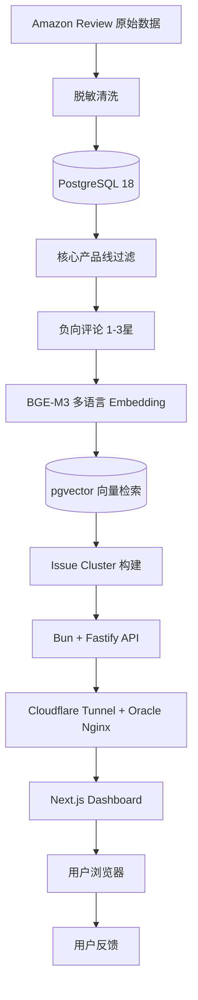
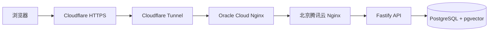

# VOC Review Insight Dashboard

基于 **Next.js + TypeScript + Tailwind CSS** 构建的智能硬件 VOC 问题洞察看板。

该看板用于展示 Amazon 智能硬件评论分析结果，前端通过 HTTPS 调用 `VOC Review Insight API`，展示评论规模、核心负向评论、Embedding 覆盖情况、Issue Cluster、严重度、代表评论和改进建议。

公网访问：

```text
https://voc.chenchangchao.com
```

后端 API：

```text
https://api.chenchangchao.com
```

## 1. 项目定位

本项目是完整 VOC Review Insight 系统的前端看板层。

整体系统目标：

将多语言 Amazon Review 转化为可追溯、可解释、可展示的产品质量 Issue Cluster，帮助产品、质量、售后和运营团队快速发现智能硬件的高频负向问题。

当前覆盖产品线：

| 产品线 | 说明 |
| --- | --- |
| `dash_cam` | 行车记录仪 |
| `video_doorbell` | 视频门铃 |
| `ipc` | IPC 摄像机 |

当前看板展示：

| 模块 | 说明 |
| --- | --- |
| 总览指标 | 原始评论、核心评论、负向评论、向量化评论、问题簇、高严重度簇 |
| Issue Cluster 总览 | 展示所有 VOC 问题簇 |
| 高严重度问题 | severity ≥ 4 的重点问题 |
| 产品线分布 | 按产品线展示问题簇数量 |
| Cluster 详情页 | 展示问题摘要、改进建议、代表评论与相似度 |
| API 状态 | 展示后端 API / DB 健康状态 |

## 2. 当前效果

当前线上地址：

```text
https://voc.chenchangchao.com
```

后端健康检查：

```bash
curl https://api.chenchangchao.com/health
```

指标接口：

```bash
curl https://api.chenchangchao.com/metrics
```

问题簇接口：

```bash
curl https://api.chenchangchao.com/clusters
```

示例指标：

```json
{
  "total_reviews": 8756,
  "core_reviews": 7209,
  "core_negative_reviews": 1394,
  "embedded_reviews": 1391,
  "issue_clusters": 8,
  "high_severity_clusters": 5
}
```

## 3. 系统架构



部署链路：



## 4. 技术栈

| 层级 | 技术 |
| --- | --- |
| 前端框架 | Next.js App Router |
| 语言 | TypeScript |
| 样式 | Tailwind CSS |
| 图标 | lucide-react |
| API 调用 | fetch / Server Component |
| 部署 | Oracle Cloud + PM2 |
| HTTPS | Cloudflare Tunnel |
| 后端 | Bun + TypeScript + Fastify |
| 数据库 | PostgreSQL 18 + pgvector |
| Embedding | BGE-M3 |

## 5. 数据来源

前端不直接连接数据库，而是调用后端 API：

```bash
NEXT_PUBLIC_API_BASE_URL=https://api.chenchangchao.com
```

主要接口：

| API | 用途 |
| --- | --- |
| `GET /health` | API / DB 健康检查 |
| `GET /metrics` | 总览指标 |
| `GET /clusters` | Issue Cluster 列表 |
| `GET /clusters/:clusterKey` | 单个问题簇摘要 |
| `GET /clusters/:clusterKey/reviews` | 问题簇代表评论 |
| `GET /reviews/:reviewId/similar` | 相似评论召回 |

## 6. 当前 Issue Cluster

当前系统沉淀 8 个高质量 VOC 问题簇：

| 产品线 | Cluster Key | 问题簇 | 严重度 |
| --- | --- | --- | ---: |
| dash_cam | `dash_cam_power_reboot_failure` | 行车记录仪短期使用后重启、关机或无法启动 | 4 |
| dash_cam | `dash_cam_rear_camera_failure` | 行车记录仪后摄像头无法工作或无法连接 | 4 |
| dash_cam | `dash_cam_sd_card_storage_issue` | 行车记录仪 SD 卡、存储或格式化异常 | 4 |
| dash_cam | `dash_cam_video_quality_not_as_advertised` | 行车记录仪画质或 4K 宣传不符 | 3 |
| ipc | `ipc_camera_offline_or_hardware_failure` | IPC 摄像机停止工作、离线或无法重置 | 4 |
| video_doorbell | `video_doorbell_battery_power_issue` | 视频门铃电池续航短或耗电过快 | 3 |
| video_doorbell | `video_doorbell_connection_failure` | 视频门铃联网或配网失败 | 4 |
| video_doorbell | `video_doorbell_motion_detection_false_miss` | 视频门铃移动侦测误报、漏报或响应延迟 | 3 |

## 7. 本地开发

### 7.1 安装依赖

```bash
bun install
```

### 7.2 环境变量

创建 `.env.local`：

```bash
cat > .env.local <<'ENV'
NEXT_PUBLIC_API_BASE_URL=https://api.chenchangchao.com
EMAIL_SMTP_HOST=smtp.example.com
EMAIL_SMTP_PORT=587
EMAIL_SMTP_SECURE=false
EMAIL_SMTP_USER=sender@example.com
EMAIL_SMTP_PASS=your-password-or-app-password
EMAIL_FROM="VOC Review Insight Agent <sender@example.com>"
EMAIL_WORKFLOW_SECRET=change-me
ENV
```

也可以参考 `.env.example`：

```bash
cp .env.example .env.local
```

### 7.3 邮箱推送与定时 Workflow

工作台支持在生成 8D 报告后输入收件邮箱并发送 Markdown 报告。SMTP 配置只在服务端读取，不会暴露给浏览器。

常用环境变量：

| 变量 | 说明 |
| --- | --- |
| `EMAIL_SMTP_HOST` | SMTP 服务器地址 |
| `EMAIL_SMTP_PORT` | SMTP 端口，常用 `587` 或 `465` |
| `EMAIL_SMTP_SECURE` | `465` 通常为 `true`，`587` 通常为 `false` |
| `EMAIL_SMTP_USER` | 发件邮箱账号 |
| `EMAIL_SMTP_PASS` | SMTP 密码或应用专用密码 |
| `EMAIL_FROM` | 发件人显示名和邮箱 |
| `EMAIL_WORKFLOW_SECRET` | 定时 workflow 调用密钥 |
| `EMAIL_WORKFLOW_RECIPIENTS` | 定时报告默认收件人，多个邮箱用逗号分隔 |
| `EMAIL_WORKFLOW_CLUSTER_KEYS` | 定时报告指定问题簇，留空则按严重度自动选择 |
| `EMAIL_WORKFLOW_MAX_CLUSTERS` | 自动选择的问题簇数量，默认 `3` |

定时任务可以由 cron、PM2 cron、GitHub Actions 或云函数调用：

```bash
curl -X POST https://voc.chenchangchao.com/api/agent/email-workflow \
  -H 'Content-Type: application/json' \
  -H 'Authorization: Bearer change-me' \
  -d '{
    "recipients": ["quality@example.com"],
    "clusterKeys": ["dash_cam_power_reboot_failure"]
  }'
```

### 7.4 启动开发环境

```bash
bun run dev
```

访问：

```text
http://127.0.0.1:3000
```

## 8. 生产构建

```bash
bun run build
```

启动：

```bash
bun run start
```

默认监听：

```text
http://127.0.0.1:3000
```

## 9. PM2 常驻运行

在 Oracle Cloud 主机上：

```bash
cd ~/apps/voc-dashboard

pm2 start "bun run start" --name voc-dashboard
pm2 save
pm2 list
```

查看日志：

```bash
pm2 logs voc-dashboard
```

重启：

```bash
pm2 restart voc-dashboard
```

停止：

```bash
pm2 stop voc-dashboard
```

## 10. Nginx 反向代理

Oracle Cloud 上使用 Nginx 将 Cloudflare Tunnel 的本地服务转发到 Next.js。

配置文件：

```text
/etc/nginx/sites-available/voc-gateway
```

其中 `voc.chenchangchao.com` 对应：

```nginx
server {
    listen 127.0.0.1:8081;
    server_name voc.chenchangchao.com;

    client_max_body_size 20m;

    location / {
        proxy_pass http://127.0.0.1:3000;

        proxy_http_version 1.1;

        proxy_set_header Host $host;
        proxy_set_header X-Real-IP $remote_addr;
        proxy_set_header X-Forwarded-Host $host;
        proxy_set_header X-Forwarded-For $proxy_add_x_forwarded_for;
        proxy_set_header X-Forwarded-Proto https;

        proxy_connect_timeout 60s;
        proxy_send_timeout 60s;
        proxy_read_timeout 60s;
    }
}
```

检查 Nginx：

```bash
sudo nginx -t
sudo systemctl reload nginx
```

本地测试：

```bash
curl http://127.0.0.1:3000
curl http://127.0.0.1:8081
```

公网测试：

```bash
curl https://voc.chenchangchao.com
```

## 11. Cloudflare Tunnel

当前通过 Cloudflare Tunnel 发布两个 hostname：

| Hostname | 本地服务 |
| --- | --- |
| api.chenchangchao.com | http://127.0.0.1:8080 |
| voc.chenchangchao.com | http://127.0.0.1:8081 |

Cloudflare Tunnel 页面：

```text
Zero Trust
→ Networks
→ Tunnels
→ jd-rag-api
→ Routes
```

当前链路：

```text
Browser
→ Cloudflare HTTPS
→ Cloudflare Tunnel
→ Oracle Cloud cloudflared
→ Oracle Nginx 127.0.0.1:8081
→ Next.js 127.0.0.1:3000
```

## 12. 工程目录

```text
voc-dashboard/
├── README.md
├── package.json
├── next.config.ts
├── tsconfig.json
├── .env.local
├── .env.example
├── .gitignore
└── src/
    ├── app/
    │   ├── page.tsx
    │   └── clusters/
    │       └── [clusterKey]/
    │           └── page.tsx
    └── lib/
        ├── api.ts
        └── utils.ts
```

## 13. 页面说明

### 13.1 首页

路径：

```text
/
```

包含：

- API 状态
- 原始评论数
- 核心产品评论数
- 核心负向评论数
- 已向量化评论数
- Issue Cluster 数
- 高严重度问题数
- Issue Cluster 列表
- 高严重度问题侧栏
- 产品线分布

### 13.2 Cluster 详情页

路径：

```text
/clusters/:clusterKey
```

示例：

```text
/clusters/dash_cam_sd_card_storage_issue
```

包含：

- 问题簇名称
- 产品线
- 问题类型
- 严重度
- 平均相似度
- 问题摘要
- 改进建议
- 代表评论列表
- 每条评论的相似度、星级、站点、标题和正文

## 14. 和后端项目的关系

本项目是前端看板。

后端项目：

```text
/opt/apps/agent-infra/voc-api
```

后端职责：

- 连接 PostgreSQL 18 + pgvector
- 提供 REST API
- 查询 Issue Cluster
- 查询代表评论
- 查询相似评论
- 暴露 metrics

前端职责：

- 调用 API
- 可视化展示 VOC 问题簇
- 提供产品线 / 问题类型 / 严重度维度的可读视图
- 为后续 Agent Demo 和项目作品集提供展示入口

## 15. GitHub 提交建议

首次提交：

```bash
git init
git add README.md .gitignore .env.example package.json next.config.ts tsconfig.json src
git commit -m "init voc review insight dashboard"
```

注意不要提交：

- `.env.local`
- `node_modules`
- `.next`

## 16. 后续计划

### Phase 1：看板增强

- 增加搜索框
- 增加产品线筛选
- 增加严重度筛选
- 增加 issue_category 筛选
- 增加 Cluster 数量统计图
- 增加相似度分布图
- 增加站点分布图

### Phase 2：详情页增强

- 展示代表评论原文语言
- 展示国家站点分布
- 展示相似度排序
- 支持复制 Cluster Summary
- 支持跳转 API JSON

### Phase 3：Agent 化

将后端 API 封装为 Agent Tool：

- `get_metrics`
- `list_clusters`
- `get_cluster_detail`
- `find_similar_reviews`
- `summarize_cluster`

最终目标：

让用户可以用自然语言询问：“视频门铃最近主要差评是什么？”、“行车记录仪哪些问题最严重？”、“SD 卡异常问题有哪些代表评论？”系统通过 Agent 自动查询 API 并生成业务分析报告。

## git cli
```bash
git config --list
git config --global user.name  "chenchangchao"
git config --global user.email "648023262@qq.com"
ssh-keygen -t rsa -C "648023262@qq.com"
cat ~/.ssh/id_rsa.pub
git status

git remote add origin git@github.com:chenchangchao/voc-dashboard.git
git branch -M main
git add .
git commit -m "init it"
git push -u origin main
```
## Agent 化能力

当前项目已经接入 VOC Quality Agent，用于根据 Issue Cluster 自动生成 8D 报告草稿。

### Agent 页面

```text
https://voc.chenchangchao.com/agent
```

## 当前能力
- 选择 VOC Issue Cluster
- 调用 VOC API 获取指标、问题簇、代表评论和相似评论
- 调用 DeepSeek 生成 8D Markdown 报告草稿
- 支持将报告摘要推送到飞书群机器人
- 支持将完整 Markdown 报告作为附件发送到飞书群
- 支持跳转 Dashboard 详情页、8D 报告页和 API JSON

## Agent 工具链
- get_metrics
- list_clusters
- get_cluster_reviews
- generate_8d_report
- send_feishu_card
- send_feishu_markdown_file


## 飞书推送链路
```
Next.js Agent API
→ DeepSeek 生成 8D Markdown
→ 飞书 webhook 发送卡片摘要
→ 飞书 OpenAPI 上传 Markdown 文件
→ 飞书 OpenAPI 发送文件消息到群
```
